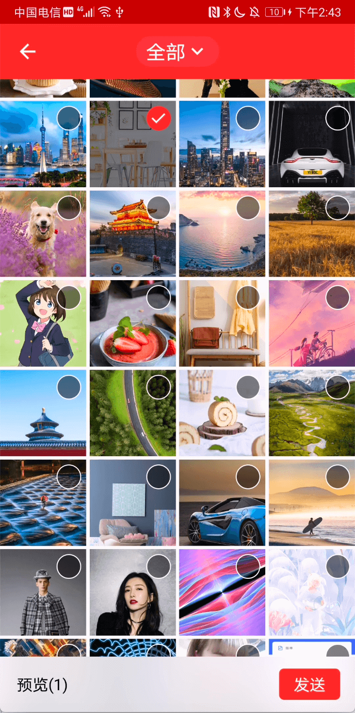
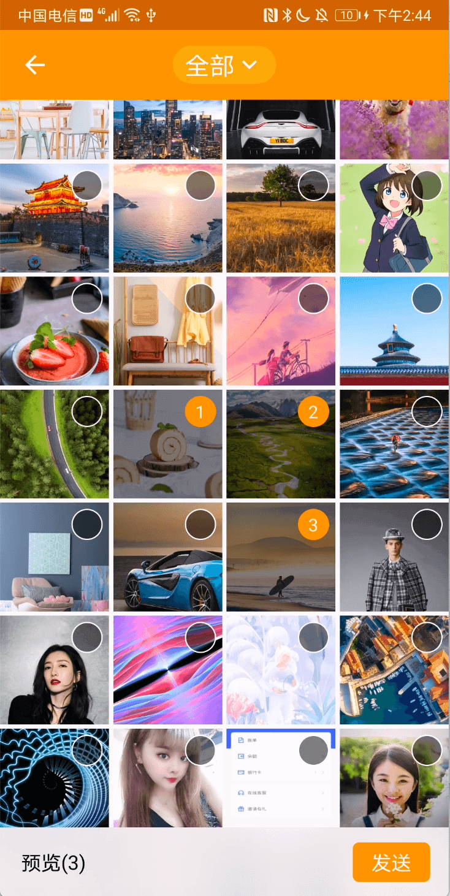

# 👨‍💻‍CodeLib🔎
本项目添加一些开发过程中常用到的代码，通过系统集成后会抽成库进行使用

目前发布的库：
## 手机相册图片视频选择库：<font color=#2196F3 size=16>AlbumManager</font>

[](https://github.com/student9128/CodeLib)
[](https://github.com/student9128/CodeLib/releases/tag/v1.0.4)

[](https://shields.io/)

<div>


</div>


### DownLoad
```
dependencies {
    implementation 'io.github.student9128:albummanager:1.0.4'
}
```
### How to use?

- 代码使用
```kotlin
   AlbumManager.withContext(this)
                    .openAlbum(AlbumConstant.TYPE_ALL)
                    .setTheme(AlbumTheme.Red)
                    .showCameraShot(true)
                    .showSelectedWithNum(false)
                    .maxSelectedNum(9)
                    .forResult(AlbumConstant.REQUEST_CODE_ALBUM_RESULT)


   override fun onActivityResult(requestCode: Int, resultCode: Int, data: Intent?) {
        super.onActivityResult(requestCode, resultCode, data)
        if (resultCode == RESULT_OK) {
            when (requestCode) {
                AlbumConstant.REQUEST_CODE_ALBUM_RESULT -> {
                    val albumManagerCollectionInstance =
                                           AlbumManagerCollection.albumManagerCollectionInstance
                    val selectionData = albumManagerCollectionInstance.getSelectionData()
                    val path = selectionData!![0].path
                    Glide.with(this)
                        .load(path)
                        .into(iv_preview)
                    tv_preview_path.text = path
                }
            }
        }
    }
```
### Thank You
该库的集成参考了[Matisse](https://github.com/zhihu/Matisse), [PictureSelector](https://github.com/LuckSiege/PictureSelector)。

依赖的了第三方库有

[Glide](https://github.com/bumptech/glide)

[Blur-LIB-Android](https://github.com/danielzeller/Blur-LIB-Android)

[imagezoom](https://github.com/sephiroth74/ImageViewZoom)

# License
```
Copyright 2021 Kevin.

Licensed under the Apache License, Version 2.0 (the "License");
you may not use this file except in compliance with the License.
You may obtain a copy of the License at

   http://www.apache.org/licenses/LICENSE-2.0

Unless required by applicable law or agreed to in writing, software
distributed under the License is distributed on an "AS IS" BASIS,
WITHOUT WARRANTIES OR CONDITIONS OF ANY KIND, either express or implied.
See the License for the specific language governing permissions and
limitations under the License.
```
